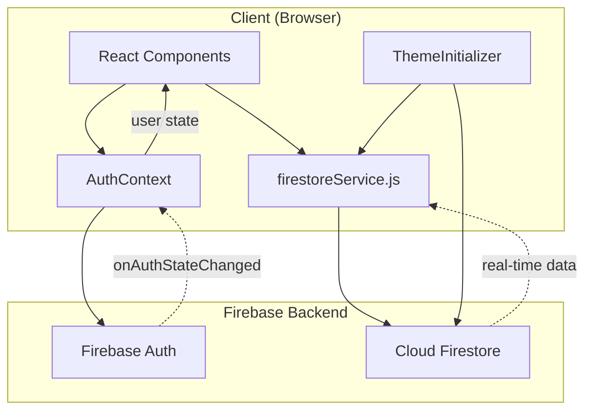

# Project Architecture: LearnToType

## Overview

LearnToType is a modern, interactive typing practice platform that combines features from Monkeytype, TypeRacer, and Typing.com. The application helps users improve typing skills through customizable tests, typing games, structured lessons, and progress tracking with analytics.

**Type:** Single Page Application (SPA)  
**Primary Language:** JavaScript (ES6+)  
**Framework:** Next.js 16 + React 19  
**Styling:** Tailwind CSS v3 + CSS Variables  
**Backend:** Firebase (Authentication + Firestore)  
**Deployment:** Firebase Hosting (Static Export)

**Live Site:** [learntotype.xyz](https://learntotype.xyz)

---

## Directory Structure

```
capstone-project/
├── .env.local                 # Environment variables (Firebase config)
├── .firebase/                 # Firebase deployment cache
├── .firebaserc                # Firebase project aliases
├── .next/                     # Next.js build output (dev)
├── context/
│   └── AuthContext.js         # React Context for authentication state
├── docs/
│   └── architecture.md        # This file
├── lib/
│   ├── audio.js               # Audio synthesis utilities
│   ├── firebase.js            # Firebase initialization
│   ├── firestoreService.js    # Firestore CRUD operations
│   └── utils.js               # Utility functions
├── out/                       # Static export output for Firebase Hosting
├── public/
│   ├── *.html                 # Pre-rendered HTML pages
│   └── *.svg                  # Static assets
├── src/
│   ├── app/                   # Next.js App Router pages
│   │   ├── globals.css        # Global styles + CSS variables
│   │   ├── layout.js          # Root layout with providers
│   │   ├── page.js            # Login page (/)
│   │   ├── games/             # Typing games (/games)
│   │   ├── landingPage/       # Post-login landing (/landingPage)
│   │   ├── leaderboard/       # Game leaderboards (/leaderboard)
│   │   ├── lessons/           # Structured lessons (/lessons)
│   │   ├── progress/          # User progress (/progress)
│   │   └── tests/             # Typing tests (/tests)
│   ├── components/
│   │   ├── ContainerTextFlip.js   # Animated text component
│   │   ├── Navbar.js              # Navigation + user menu
│   │   ├── ProfileModal.js        # User profile modal
│   │   ├── ProtectedRoute.js      # Auth guard wrapper
│   │   ├── ResultsModal.js        # Test results display
│   │   ├── SettingsModal.js       # Theme/sound settings
│   │   ├── ThemeInitializer.js    # Theme CSS variable loader
│   │   └── ui/
│   │       └── sparkles.js        # Particle effects (Aceternity)
│   ├── hooks/
│   │   └── useGameScore.js        # Game score persistence hook
│   └── lib/
│       └── utils.js               # Client-side utilities
├── firebase.json              # Firebase Hosting configuration
├── firestore.rules            # Firestore security rules
├── next.config.mjs            # Next.js configuration
├── package.json               # Dependencies and scripts
├── postcss.config.js          # PostCSS configuration
└── tailwind.config.js         # Tailwind CSS configuration
```

---

## Core Components

### Authentication Layer

#### [AuthContext.js](file:///capstone-project/context/AuthContext.js)
**Location:** `context/AuthContext.js`  
**Purpose:** Provides global authentication state and functions via React Context

**Key Responsibilities:**
- Manages user authentication state (`user`, `loading`)
- Provides `login()`, `signup()`, `loginWithGoogle()`, and `logout()` functions
- Auto-creates Firestore user profiles on signup/first Google login
- Wraps the entire application via `AuthProvider`

**Dependencies:**
- Firebase Auth (`firebase/auth`)
- `firestoreService.createUserProfile()`

---

#### [ProtectedRoute.js](file:///capstone-project/src/components/ProtectedRoute.js)
**Location:** `src/components/ProtectedRoute.js`  
**Purpose:** Guards authenticated routes, redirects unauthenticated users

**Key Responsibilities:**
- Wraps page content in `layout.js`
- Shows loading state during auth check
- Redirects to login (`/`) if not authenticated
- Redirects to landing page (`/landingPage`) if authenticated on login page

---

### Firebase Services

#### [firebase.js](file:///capstone-project/lib/firebase.js)
**Location:** `lib/firebase.js`  
**Purpose:** Initializes Firebase app, Auth, and Firestore instances

**Exports:**
- `auth` - Firebase Auth instance
- `db` - Firestore database instance

**Features:**
- Environment-based configuration via `NEXT_PUBLIC_*` variables
- Optional emulator support for local development

---

#### [firestoreService.js](file:///capstone-project/lib/firestoreService.js)
**Location:** `lib/firestoreService.js`  
**Purpose:** Centralized Firestore CRUD operations

**Exported Functions:**

| Function | Description |
|----------|-------------|
| `createUserProfile()` | Create/update user document with stats |
| `getUserProfile()` | Fetch user profile data |
| `updateUserProfile()` | Update user profile fields |
| `saveTypingTestResult()` | Save individual test results |
| `updateUserStats()` | Update user statistics |
| `saveLessonProgress()` | Save lesson completion data |
| `saveGameHighScore()` | Save game scores (only if new high) |
| `getGameHighScore()` | Fetch user's game high score |
| `getAllUsersGameScores()` | Fetch all users for leaderboard |
| `updateUserSettings()` | Save theme/sound preferences |

---

### UI Components

#### [Navbar.js](file:///capstone-project/src/components/Navbar.js)
**Location:** `src/components/Navbar.js`  
**Purpose:** Main navigation bar with user menu dropdown

**Key Responsibilities:**
- Navigation links: Tests, Lessons, Games, Leaderboard, Progress
- User menu: Profile, Settings, Logout
- Opens ProfileModal and SettingsModal

---

#### [SettingsModal.js](file:///capstone-project/src/components/SettingsModal.js)
**Location:** `src/components/SettingsModal.js`  
**Purpose:** User preferences modal for theme and sound settings

**Key Responsibilities:**
- Theme selection and live preview
- Sound effect selection with WebAudio preview
- Persists settings to Firestore via `updateUserSettings()`

---

#### [ResultsModal.js](file:///capstone-project/src/components/ResultsModal.js)
**Location:** `src/components/ResultsModal.js`  
**Purpose:** Displays typing test results

**Key Features:**
- Shows WPM, Accuracy, Mode
- Keyboard shortcuts: `Tab` to restart, `Escape` to close
- Space for future graph implementation

---

#### [ThemeInitializer.js](file:///capstone-project/src/components/ThemeInitializer.js)
**Location:** `src/components/ThemeInitializer.js`  
**Purpose:** Loads and applies user's theme preference on app load

**Key Responsibilities:**
- Fetches settings from Firestore on auth state change
- Applies theme class to document body
- Falls back to default theme if none saved

---

### Page Components

#### [page.js (Login)](file:///capstone-project/src/app/page.js)
**Location:** `src/app/page.js`  
**Purpose:** Login/Signup page with email and Google authentication

**Features:**
- Email/password login and signup forms
- Google OAuth login
- Sparkle particle background effect
- Auto-redirect after successful auth

---

#### [Tests Page](file:///capstone-project/src/app/tests/page.js)
**Location:** `src/app/tests/page.js`  
**Purpose:** Customizable typing tests

**Features:**
- Word-based typing with live WPM/accuracy calculation
- Three modes: Short (25), Medium (50), Long (100) words
- Deterministic word generation with seeded randomness
- Results displayed in ResultsModal
- CSS module styling (`tests.module.css`)

**Key State:**
- `typedChars[]` - Character-by-character input tracking
- `startTime` / `endTime` - For WPM calculation
- `mode` - Selected word count mode

---

#### [Games Page](file:///capstone-project/src/app/games/page.js)
**Location:** `src/app/games/page.js`  
**Purpose:** Typing-based games for skill practice

**Contains Two Games:**

1. **Word Fall Game** (`GamesPage` component)
   - Words fall from top of screen
   - Type words before they reach bottom
   - Difficulty presets: Beginner, Intermediate, Expert
   - Canvas-based rendering

2. **Keyboard Jump Game** (`KeyboardJumpGame` component)
   - Platform jumping game controlled by typing
   - Level-based progression
   - Canvas-based with custom rendering

**Shared Features:**
- High score saving to Firestore
- Difficulty selection
- Pause/resume functionality

---

#### [Lessons Page](file:///capstone-project/src/app/lessons/page.js)
**Location:** `src/app/lessons/page.js`  
**Purpose:** Structured typing curriculum

**Lesson Structure:**
- **Beginner** (10 lessons): Home row basics, hand placement, core clusters
- **Intermediate** (10 lessons): Top/bottom rows, punctuation, capitals
- **Expert** (12 lessons): Full keyboard, symbols, numbers, speed drills

**Features:**
- Progressive skill building
- Hand placement info screens
- Accuracy tracking per lesson
- CSS module styling (`lessons.module.css`)

---

#### [Leaderboard Page](file:///capstone-project/src/app/leaderboard/page.js)
**Location:** `src/app/leaderboard/page.js`  
**Purpose:** Global game high score rankings

**Features:**
- Fetches all users' game scores via `getAllUsersGameScores()`
- Displays ranked lists per game
- Shows user display names and scores

---

#### [Progress Page](file:///capstone-project/src/app/progress/page.js)
**Location:** `src/app/progress/page.js`  
**Purpose:** User statistics and progress tracking

**Displays:**
- Average WPM, accuracy, best WPM
- Tests completed, time practiced
- Lesson progress, current streak

---

## Application Entry Points

### Primary Entry
- **Root Layout:** `src/app/layout.js` - Wraps all pages with providers
- **Login Page:** `src/app/page.js` - Default route (`/`)

### Provider Hierarchy
```
<html>
  <body>
    <AuthProvider>           <!-- Authentication state -->
      <ThemeInitializer />   <!-- Theme loading -->
      <ProtectedRoute>       <!-- Auth guard -->
        {children}            <!-- Page content -->
      </ProtectedRoute>
    </AuthProvider>
  </body>
</html>
```

### App Router Routes
| Route | Page Component | Auth Required |
|-------|---------------|---------------|
| `/` | Login | No |
| `/landingPage` | Landing Page | Yes |
| `/tests` | Typing Tests | Yes |
| `/lessons` | Lessons | Yes |
| `/games` | Games | Yes |
| `/leaderboard` | Leaderboard | Yes |
| `/progress` | Progress | Yes |

---

## Configuration

### Environment Variables (`.env.local`)
```env
NEXT_PUBLIC_FIREBASE_API_KEY=
NEXT_PUBLIC_FIREBASE_AUTH_DOMAIN=
NEXT_PUBLIC_FIREBASE_PROJECT_ID=
NEXT_PUBLIC_FIREBASE_STORAGE_BUCKET=
NEXT_PUBLIC_FIREBASE_MESSAGING_SENDER_ID=
NEXT_PUBLIC_FIREBASE_APP_ID=
NEXT_PUBLIC_FIREBASE_MEASUREMENT_ID=
NEXT_PUBLIC_USE_FIREBASE_EMULATOR=    # Optional: 'true' for local dev
```

### Next.js Configuration (`next.config.mjs`)
```javascript
{
  output: 'export',        // Static export for Firebase Hosting
  trailingSlash: true,     // Required for Firebase Hosting SPA
  images: { unoptimized: true }
}
```

### Firebase Configuration (`firebase.json`)
- **Hosting:** Serves from `out/` directory
- **Firestore:** Rules from `firestore.rules`
- **Emulators:** Auth (9099), Hosting (5003), UI enabled
- **Caching:** Long cache for static assets, revalidate HTML

### Firestore Security Rules
```
// Authenticated users can read/write all documents
allow read, write: if request.auth != null;
```

---

## Data Models

### Firestore Collections

#### `users/{userId}`
```typescript
{
  email: string,
  displayName: string,
  createdAt: Timestamp,
  updatedAt: Timestamp,
  stats: {
    averageWPM: number,
    accuracy: number,
    testsCompleted: number,
    timePracticed: number,
    bestWPM: number,
    currentStreak: number,
    lessonsCompleted: number
  },
  gameScores: {
    [gameName]: {
      highScore: number,
      lastUpdated: Timestamp
    }
  },
  settings: {
    theme: string,
    soundEffect: string
  }
}
```

#### `users/{userId}/typingTests/{testId}`
```typescript
{
  wpm: number,
  accuracy: number,
  mode: string,
  timestamp: Timestamp
}
```

#### `users/{userId}/lessons/{lessonId}`
```typescript
{
  lessonId: string,
  completed: boolean,
  accuracy: number,
  timestamp: Timestamp
}
```

---

## Data Flow



### Authentication Flow
1. User enters credentials or clicks Google login
2. `AuthContext` calls Firebase Auth methods
3. On success, Firestore profile is created/fetched
4. `ProtectedRoute` redirects to landing page
5. `ThemeInitializer` loads user's theme preference

### Typing Test Flow
1. User selects mode and starts typing
2. Each keystroke updates `typedChars` state
3. WPM/accuracy calculated on each character
4. On completion, results shown in `ResultsModal`
5. Results can be saved to Firestore

### Game Score Flow
1. User plays game, accumulates score
2. On game end, `saveGameHighScore()` called
3. Score compared to existing high score
4. Only saved if new score is higher
5. Leaderboard page fetches all users' scores

---

## External Dependencies

### Runtime Dependencies

| Package | Purpose |
|---------|---------|
| `next` (16.x) | React framework with App Router |
| `react` / `react-dom` (19.x) | UI library |
| `firebase` (12.x) | Auth + Firestore SDK |
| `framer-motion` | Animation library |
| `chart.js` / `react-chartjs-2` | Charting for analytics |
| `@tsparticles/*` | Particle effects |
| `clsx` / `tailwind-merge` | Class name utilities |

### Development Dependencies

| Package | Purpose |
|---------|---------|
| `tailwindcss` (3.x) | Utility-first CSS |
| `tailwindcss-animate` | Animation utilities |
| `autoprefixer` / `postcss` | CSS processing |
| `eslint` / `eslint-config-next` | Code linting |

---

## Build Process

### Development
```bash
npm run dev    # Starts Next.js dev server with Turbopack
```

### Production Build
```bash
npm run build  # Creates static export in out/
```

### Deployment
```bash
firebase deploy  # Deploys out/ to Firebase Hosting
```

### Output
- Static HTML files in `out/`
- Pre-rendered pages with client-side hydration
- All routes served via SPA fallback

---

## Testing Infrastructure

### Test Directories
- `src/hooks/__tests__/` - Hook unit tests
- `__mocks__/` - Mock implementations

### Testing Setup
- Tests can be run via standard Jest/React Testing Library
- No explicit test configuration in package.json (uses Next.js defaults)

---

## Development Workflow

### Common Tasks

| Task | Command |
|------|---------|
| Start dev server | `npm run dev` |
| Build for production | `npm run build` |
| Run linter | `npm run lint` |
| Deploy to Firebase | `firebase deploy` |
| Start Firebase emulator | `firebase emulators:start` |

### Adding New Pages
1. Create folder in `src/app/[route]/`
2. Add `page.js` with default export
3. Add route to Navbar links if needed

### Adding New Components
1. Create in `src/components/`
2. Use `"use client"` directive for client components
3. Import from `@/src/components/[Name]`

### Adding shadcn Components
```bash
npx shadcn@latest add [component-name]
```

---

## Theming System

### CSS Variables
Themes are implemented using CSS custom properties defined in `globals.css`:

```css
:root {
  --bg: ...;
  --text: ...;
  --surface: ...;
  --accent-1: ...;
  --accent-2: ...;
  --border: ...;
  --muted: ...;
}

.theme-[name] {
  /* Override variables */
}
```

### Theme Application
1. `ThemeInitializer` fetches user's saved theme on auth
2. Applies theme class to `document.body`
3. `SettingsModal` allows theme preview and saving

### Tailwind Integration
Tailwind config maps CSS variables to color utilities:
- `bg-background` → `var(--bg)`
- `text-foreground` → `var(--text)`
- `bg-primary` → `var(--accent-1)`

---

## Important Notes

1. **Static Export**: The app uses `output: 'export'` for Firebase Hosting. All pages must be client-renderable.

2. **Auth Requirement**: All routes except `/` require authentication. `ProtectedRoute` handles redirects.

3. **High Score Logic**: Game scores only update when new score exceeds existing high score.

4. **Theme Persistence**: Themes are saved to Firestore and loaded on each session start.

5. **Deterministic Words**: Typing tests use seeded randomness for consistent word generation.

---

*Last Updated: 2026-02-03*
